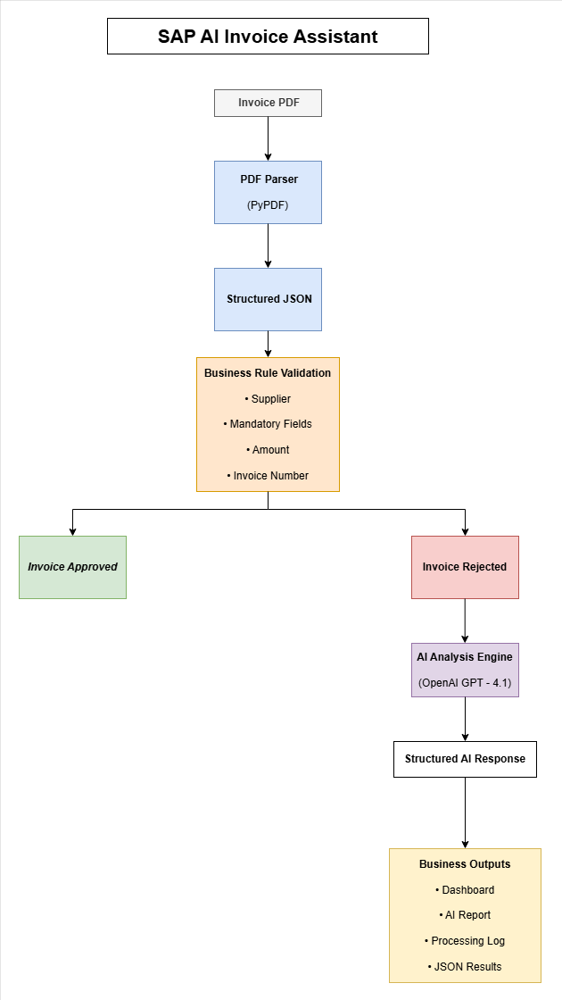
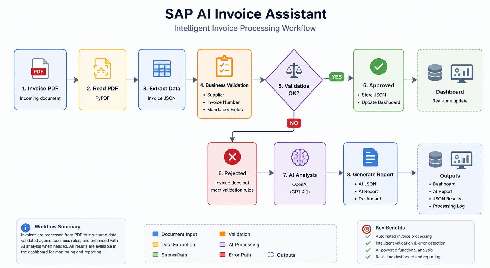

# SAP AI Invoice Assistant

> AI-powered invoice validation inspired by SAP FI/MM business processes and SAP BTP architecture.

---

## Overview

SAP AI Invoice Assistant is a portfolio project that simulates an intelligent invoice validation process similar to those used in SAP Finance (FI/MM).

The application automatically:

- Reads invoice PDFs
- Extracts structured information
- Validates business rules
- Detects business exceptions
- Uses AI to generate a functional analysis
- Produces reports, logs and an interactive dashboard

The objective is not only to automate invoice processing, but also to demonstrate how Artificial Intelligence can support SAP business processes.

---

## Solution Architecture



---

## Workflow



---

## Features

- PDF invoice processing
- Automatic data extraction
- JSON generation
- Business rule validation
- Supplier validation
- Invoice number validation
- AI-powered functional analysis
- Processing logs
- Interactive HTML dashboard
- AI structured responses (JSON)

---

## Technologies

| Technology | Purpose |
|------------|---------|
| Python | Backend |
| PyPDF | PDF parsing |
| OpenAI API | AI functional analysis |
| JSON | Structured data |
| HTML | Dashboard |
| ReportLab | Demo invoice generation |

---

## Project Structure

```text
SAP-AI-Invoice-Assistant

├── data/
├── docs/
├── input/
├── output/
├── scripts/
├── test_data/
├── dashboard.html
├── requirements.txt
└── README.md
```

---

## Processing Flow

```text
Invoice PDF

↓

PDF Parser

↓

Structured JSON

↓

Business Validation

↓

Approved
      │

Rejected

↓

AI Analysis

↓

Dashboard
```

---


## Dashboard

The project generates an interactive HTML dashboard with invoice status, validation results and AI analysis.

[Open Live Dashboard](https://atr3dstudio.github.io/SAP-AI-Invoice-Assistant/dashboard.html)

---

## AI Functional Analysis

Rejected invoices are automatically analysed using OpenAI.

The AI provides:

- Executive summary
- Severity
- SAP module involved
- Business impact
- Recommended action
- Suggested SAP BTP service

---

## Run

Generate demo invoices

```bash
python scripts/generar_facturas_demo.py
```

Process invoices

```bash
python scripts/leer_pdf.py
```

Generate dashboard

```bash
python scripts/generar_dashboard.py
```

---

## Future Improvements

- SAP Integration Suite integration
- SAP Document Information Extraction
- SAP Joule integration
- n8n workflow automation
- Email notifications
- REST API
- Database persistence

---

## Version

**v1.0**

Portfolio project focused on:

- SAP FI
- SAP BTP
- Artificial Intelligence
- Process Automation
- Solution Architecture